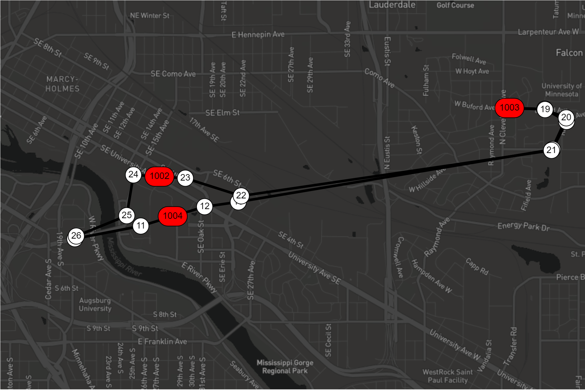

# Enhancing and Extending The Visual Transit System Simulator

## Iteration 2
### Version 4, April 7th - clarified documentation items - only writing about observer pattern this iteration.
### Version 3, April 5th - clarifications to Version 2, and correction to documentation directions - you do not need to document the code in project/web_graphics, you do need to document new code or code you change (using Doxygen and self-documenting code in the project/web_code/web directory, along with any changes you make to code in the project/src directory). Finally, weighting of grades for implementation and design have been updated.
### Version 2, April 4th - Factory requirements specified in detail
### Version 1, March 31st - Unit tests update moved to final deliverable, regression test requirements updated, code assessment section revised. 
### Initial Release, March 23
## NOTE: This document will be subject to change. In most cases you will be notified of the changes via the announcement feature in Canvas, but you should check this document yourselves on a daily basis, as we will note the version and date of update in this document.

<hr>

**Congratulations!**  Iteration 1 is in the rear-view mirror. Onward to Iteration 2!



In the first iteration you implemented unit tests for the major classes used to implement the domain logic in the transit simulation, added a new route, enhanced the GUI, designed and implemented a bus factory, and added (or augmented) a skip-stops capability.  Most importantly, you created and augmented design documentation, first using UML to document the classes used in the simulation, and then updating the UML to incorporate the classes and methods you added.  You also documented your code using Doxygen and self-documenting code techniques. Finally, you created user documentation on how to obtain and run the transit simulation, along with a design discussion of two alternate designs of a bus factory. 

In this next iteration we will implement regression testing, the observer pattern, and bus deployment strategies to further extend and enhance the simulation. These topics will be the focus of classroom lectures and labs.  

<hr>

### Due Dates (are subject to change) and Content

| <span id="a1">Date</a> | Item | Description of Verification and Validation of Deliverable(s) |
|:----:|:-----|:------------|
| WED, April 1, 11:55pm | Regression Test ~and Fixing the Unit Tests from Iteration 1~ | submit via Github; Pass automated tests and by inspection |
| Fri, April 10, 11:55pm | Design and Implement the Observer Pattern for observing one Bus, and a Bus Depot that incorporates strategies for deploying buses. Updated Unit Tests from Iteration 1 | Pass automated tests and by inspection |

Your completed project deliverables should demonstrate good software design by implementing the appropriate design methodologies and development practices. You should rigorously follow the process for using version control you learned in lab 10 and documentation procedures learned in lab 07. 

Intermediate deadlines are designed to keep you on track in the iterative development process you are using for iteration 2 and the rest of the project this semester.

For this iteration you will be submitting the following deliverables based upon the timetable specified above. Below is the order of submission:

1. First deliverables: 

Create a regression test designed to ensure that changes to your existing program development environment (e.g., makefile) or code does not adversely affect the existing features of the simulation that have already been implemented (that is, your code still works as it was working before -- unless you intentionally altered it and expected new results). ~~  Further details can be found in the section Deliverables and Submission Process.

2. Final deliverables: 

    1. Implementation of an observer pattern for one bus. Further details can be found in the section Deliverables and Submission Process. **See: [Observer Pattern]( https://www.geeksforgeeks.org/observer-pattern-set-1-introduction/)** for an overview of the observer pattern. 
    2.  Implementation of a Bus Depot utilizing different strategies for the deployment of buses based upon differing sets of criteria, for example: time of day and/or route information, etc. Further details can be found in the section Deliverables and Submission Process.
The strategy pattern may be useful for designing and implementing this capability. **See: [Strategy Pattern](https://www.geeksforgeeks.org/strategy-pattern-set-1/)** for an overview of the strategy pattern.  See the following links for examples of implementation of the strategy patten in Java and C++: </br>
         a. https://www.geeksforgeeks.org/strategy-pattern-set-2 (in Java), </br>
         b. https://sourcemaking.com/design_patterns/strategy/cpp/1) (in C++)</br>
   3. Fix the unit tests from the first iteration based upon the feedback you received.
   4. In your Doxygen mainpage add a section named: **"Designing and Implementing the Observer Pattern"** that discusses the design and implementation of your observer pattern for observing information about a bus as it proceeds along a route. Specify what classes and methods you had to add and where you had to add them -- and include pictures where applicable and possible. Note which parts of the design and implementation were most difficult for you, and include any tips or advice on how to understand and implement the pattern -- for example, what sources of information (e.g. documentation, lecture, lab) helped you understand that pattern, and what enabled you to design and implement it (e.g. links to web sites, books, lecture, lab).
    5.  Ensure all new classes and methods you have written are properly documented. All header files must document the classes and their methods using Doxygen, and all implementation (that is, \*.cc) files must have self-documenting code. **You do not need to document the web GRAPHICS code base.** 
    6. Correct and update your UML class diagram from Iteration 1 to include the changes to your code, including all classes you added to complete the iteration 2 requirements and their relationships to each other and the previously existing classes.
    
**NOTE, if you are unable to complete all or a portion of an implementation item, include a discussion of your PROPOSED design of the observer pattern in your mainpage, and your PROPOSED class design / changes for all your implementation items in your UML, and note that in a paragraph at the top of your mainpage so you receive credit for your design efforts. (Tell us what you did not sucessfully implement -- success is defined as the functionality compiles and executes.)**

#### Deliverables and Submission Process

With the exception of the PDF versions of your UML diagrams, which will be submitted via an assignment item on Canvas, you will submit all your deliverables via GitHub according to the process specified lab 10.  We will tag and pull your repository at the specified due dates and grade them according to the contents at that time. **The first deliverables due on April 1 (regression test, updated unit tests) should be in your devel branch. Your final deliverables (due April 10) should in your master branch.** **Note -** *failure to submit you deliverables in the required branch in your repository on github will result in a deduction of at least 10% from your grade for the deliverable for iteration 2.*

>#### You must verify that your submission compiles on a cselabs machine and it is complete. You will receive zero or be heavily penalized if your code does not compile and/or we cannot generate documentation using Doxygen as specified in Lab 7 upon submission.

The schedule is very tight, and it is important that you keep up with the project. The project will continue to build throughout the semester, and if you get behind, it will be very difficult to catch up. For this reason, **late assignments will not be accepted**, but you will receive partial credit for partial completion of the requirements -- so **ALWAYS MAKE SURE TO SUBMIT SOMETHING - SOME POINTS ARE BETTER THAN NONE**.

You can convert this requirements document to pdf using this tool: http://www.markdowntopdf.com/

<hr>

### Overview

In this iteration, you will do the following development:

- enhancing/modifying the base code.
- formulating regression tests (one in lab, and another one that you will submit on the first delivery date).
- implementing at least one new design pattern: the observer pattern, and potentially the strategy pattern.
- augmenting the simulation class structure. 
- augmenting the design discussion in your Doxygen mainpage to include a discussion on your design and implementation of the observer pattern. 
- ensuring Google style guide compliance.
- modifying/updating your iteration UML design documentation to include the classes and methods you add or refactor in iteration 2.
- using Doxygen to document all new classes and methods you add or modify in iteration 2 (in the header files only) and generate documentation.
- using Git, and producing self-documenting code (i.e. good organization and naming conventions in the header and cc files). 

Teaching staff (Undergraduate TA's, Graduate TA's, and Instructors)  will also be working diligently to provide the structure and support for development, testing, and documentation. Automation in unit testing, style compliance, in-house GitHub testing, and documentation will make this an easier process, however, it means that you will have to develop within the constraints of these systems. Often there is a learning curve and a lot of systems troubleshooting to get it all working, so start early!

In the first iteration, you enhanced the core functionality of the simulation. In this iteration, you will design and implement: a regression test to ensure the core functionality of the simulation continues to function as expected when changes are made to the simulation; an observer pattern to display information about a single bus to the user; and finally, logic to determine what size buses will be deployed based upon conditions within the simulation. 

<hr>

## Documentation and Code Implementation Requirements

### Overview

In this iteration, we need to add a few new elements to our design in order to allow for configuration and visualization of our simulation. Much of this has already been designed and implemented. The primary task will be to extend your domain elements to produce the data needed for visualization, and to merge the provided configuration and visualization code into your project code.

### Functional Requirements

> This is just functionality. Along the way, please document the code you write for this iteration using
Doxygen syntax and test for Google Style compliance using cpplint.

Below we specify the three sets of functionality you are to design and deliver for this iteration.

#### Priority Level 1 : Implement a Regression Test and Fix Previous Unit Tests

For regression tests, the goal is to verify that features that worked once stay working, even as you continue to fix, add, and/or refactor the code base and the development environment (e.g. makefiles).

For our transit simulation, that means designing and implementing a structured scenario that can be run repeatedly and produce the same output each time it is executed while employing as many of the domain classes as possible.

While developing this test, you should store any config files you need in `project/config/` and anything else that might be helpful in a new directory you create named `project/resources/`, to ensure that changes you make to create the regression test do not break anything that was already working.

Designing and implementing a regression test, and how to proceed, will be covered in more detail in lecture and lab.

#### Priority Level 2 : Implement an Observer Pattern to Display Relevant Bus Information on One Bus.


This will allow the user of the simulation to gather information on a specific bus via the simulation display. To accomplish this you will need to add at least two classes: the observer class (abstract/interface) and an observable/subject class. Templates may be useful for implementing the observable/subject classes -- see zybooks for a refresher on templates. The observer pattern will be utilized to observe a single bus. 

Implementing the observer pattern will entail modifying the graphical user interface, and once again require the addition of a command to the command pattern implemented in the `my_web_server_command` files in the directory `project/web_code/web`.  

Designing and implementing the observer design pattern, and how to proceed, will be covered in more detail in lecture and lab.

#### Priority Level 3 : Implement a Bus Depot (Refactor the Factory) so it uses Deployment Strategies

To enhance the simulation even further, you will create a Bus Depot (a re-factoring of your factory pattern) that uses strategies to determine the type of buses to be deployed on a route. 
For example, depending on the time of day, only medium and large buses may be deployed in an a prespecifed sequence -- or only small buses. 

More specifically, the implementation requirements for iteration 2 require you to refactor your factory to use a time-based bus deployment strategy to determine the size of the bus to be created whenever a new bus is created by the transit simulation.  For iteration 2, the overall bus creation/deployment strategy should (that is, is required to) behave as follows:

```
Determine the current local time
If the current local time is:
6am or later but before 8 am
		Deploy the bus using strategy 1
8am or later but before 3pm 
		Deploy the bus using strategy 2
3pm or later but before 8pm
		Deploy the bus using strategy 3
Otherwise
		Deploy a small bus

The deployment strategies you should implement are as follows:
    Strategy 1 deploys busses in the following repeating sequence:
Small, Regular, Small, Regular, etc. (the sequence keeps repeating)
    Strategy 2 deploys busses in the following repeating sequence:
Regular, Large, Regular, Large, etc. (the sequence keeps repeating)
    Strategy 3 deploys busses in the following repeating sequence:
Small, Regular, Large, Small, Regular, Large, etc. (the sequence keeps 
repeating)
```

Each time the simulation is required to create a new bus, it should use the bus size returned by the strategy that is currently in effect.

**Note, when a strategy function / method is called for strategies 1, 2, and 3, it will return the next size bus in a repeating sequence.**  *One way to implement this functionality is to enable each strategy to keep track of its state.*

So for example, when the strategy in effect is Strategy 3:

* When Strategy 3 is in state 0, a small bus is returned, and the state transitions to state 1. 
* When Strategy 3 is in state 1, a regular bus is returned and the state transitions to state 2. 
* When Strategy 3 is in state 2, a large bus is returned – and the State is then reset to state 0. 
 
 Thus,  the next bus returned will be a small bus.  The sequence is then repeated, etc. 

You may find it useful to use a **static** variable and the **modulus operator** to keep track of the state and generate a repeating sequence for each strategy function / method.
 
You are NOT required to implement a particular design pattern to implement this behavior in your simulation, but the strategy pattern would be a good choice. However, you will be graded on your simulation’s ability to carry out the behavior specified above (and below in the additional requirements) for this required new functionality for iteration 2.

**Additional Requirements:**

Your simulation should print the time (in any format), strategy (1,2,3, or small), and bus size (small, regular, large) returned from by the overall bus deployment strategy to the terminal window each time the overall deployment strategy functionality is used to create a new bus. 

Other constructs and suggestions you may find helpful in formulating your design and implementation:

The strategy pattern:
    https://refactoring.guru/design-patterns/strategy/cpp/example
    https://www.geeksforgeeks.org/strategy-pattern-set-1/?ref=rp

The C++ ctime library, and the functions, time and localtime:				
    http://www.cplusplus.com/reference/ctime/
    
The struct tm (for obtaining current time in hours and minutes :	
    http://www.cplusplus.com/reference/ctime/tm/?kw=tm 

Finally, it may be helpful to convert the current time and the times used in the selection statement above (i.e., in the civilian time format) to military time, or a variant of military time:
	https://www.ontheclock.com/convert-military-24-hour-time.aspx


<hr>

### Unit Testing with Google Test

https://github.com/google/googletest

Unit tests are essential in a large-scale project, because the entire code base can be tested regularly and automatically as it is being developed. In the strictest application of Test-Driven Development (TDD), the tests are written _before_ the code, which helps solidify requirements and write testable code. Modify your unit tests based upon the feedback you have received. Remember they must be the devel branch on github. 

### Google Style Guide Compliance

https://google.github.io/styleguide/cppguide.html

Consistency in code organization, naming conventions, file structure, and formatting makes code easier to read and integrate. There are many options with various merits, so it is up to the development team to establish these
conventions, or, in the words of Kevin Wendt, an instructor for previous iterations of the course, "The only style guide that really matters is the one your boss uses." We decided to use the Google style guide because it is published, documented, and has automated tests. We don't agree with every decision, but we are complying so that we are all coding to a single standard.

To test your code for Google style compliance, you can run cpplint on a cselabs machine (and will how style compliance will be automatically checked on submission):

```
cd src
../../cpplint/cpplint-cse.sh --root=.. *.h *.cc
```

The tag `--root=..` impacts the header guard. The header guards provided in the base code all start with `SRC`. If you are getting errors due to the header guard because it is expecting `INCLUDE_SRC` or no `SRC` **do not change the header guard.** Instead, check that the flag is set properly. If the `--root` flag is not working, please notify staff so that we can figure out how to fix it.

<hr>

## Documentation

- UML diagrams
- Doxygen generated web pages for all new and modifed code (classes and methods in the .h files) including mainpage.h 
- Self-Documenting code that is Google Style compliant (for all new and modified iteration 2 code in the .cc files)

Code documentation comes in many forms for many audiences. For this project, **your audience is other programmers**, who need to understand class interfaces, function parameters, function behavior, code organization, class organization, and code logic. Self-documenting code (i.e. using good organization and naming conventions) is an efficient means of communicating, since you have to write the code anyway. _Good_ comments -- not too much, not too little -- help guide others through the logic and class interfaces. For the larger picture of code and class structure, use UML diagrams and Doxygen-generated (automatic) web pages.

#### UML

The UML diagram is a visual aid that helps other programmers better understand the code structure. It should include only those aspects that are essential, otherwise your diagram will get too cluttered and overwhelm the reader. Here are some things to keep in mind as you are designing your UML:

- Make the most important classes prominent in the layout (i.e. your eye tends to focus in that general area when you first look at it).
- Lay out the classes so that the connections have as few crossovers as possible.
- Do not include setters and getters in your methods list unless there is something special about them that you need to communicate.
- You should not include structs or enumerated types unless they add value to the understanding of the overall code structure.
- If a class is composed of another class, you can show that association with a solid line arrow (if there is only 1) or using the _compose_ diamond.
- Include cardinality where appropriate.
- Add comments to classes and/or relationships to clarify the interaction or to point out subtleties that are essential to using the code.

The final diagram you submit for iteration 2 UML should reflect the changes you made while completing the code requirements. We will be looking for proper use of UML components, and a correct depiction of the code structure.

There are many free tools that you can use to create the UML including Doxygen, and  draw.io (see: https://www.draw.io/). **Submit your UML in a .pdf file via the submission item on Canvas**.

#### Doxygen

Doxygen automatically generates documentation of class and code structure when you follow some simple conventions for commenting within your code (_see_ http://www.doxygen.nl/manual/index.html and https://caiorss.github.io/C-Cpp-Notes/Doxygen-documentation.html). You have had a lab on Doxygen (Lab 7) and we will likely cover a bit more in class. To start with, look over the documentation provided with the code base to understand how to document classes, methods, parameters, and even _todo's_ and _bugs_ in your code. In Lab 7, you learned how to compile with your Doxyfile and generate web pages. Please look over the generated web pages for missing and incorrect information. The requirements for Doxygen include:

- the file `project/docs/Doxyfile` to generate documentation (in your `project/docs` directory).

- a _mainpage.h_ file that serves as the homepage of your automated documentation. The information that you added from iteration 1 should remain. You should have a mainpage.h file that you can extend in your `project/src` directory. 

- document all classes, methods, and functions that you add in interation 2 in their header (.h) files. 

-  add a section named: **"Designing and Implementing the Observer Pattern"** that discusses the design and implementation of your observer pattern for observing information on a bus, as per the description in the final deliverables above. 


***- FINALLY: The /html directory generated by Doxygen should *not* be in your repo in github.umn.edu - nor should your build directory, executable files, or object files.***

> As part of your fresh clone prior to submission, please also compile the Doxygen documentation and look at the generated webpages.

All of these elements of documentation will be assessed, accounting for a significant portion of your grade for each iteration (for this iteration, iteration 2, documentation will account for 1/2 of your grade). Think about these two extremes: 1) your code functions perfectly and you have almost no documentation -- you will likely fail on this iteration; 2) your code is not functional and will only compile when you comment most of it out, but if you have complete, great documentation, you will likely get a decent grade on this iteration. **Get in the habit of creating the documentation along with the code.**

<hr>

## Assessment

Your software **must compile on a cselabs machine or it will not be graded, and you will receive a zero for your submission**. Your software **must compile on the _master_ branch or it will not be graded, and you will receive a zero for your submission**. We will not grade your project unless it compiles. As long as you provide a version that compiles, we will evaluate those aspects that are partially functional for partial credit. In other words, <u>comment code out if it breaks compilation</u>.

Your software will be assessed through automatic testing and by the TAs. If possible, we'll provide as much automated feedback as we can prior to the deadline. At the deadline, all submissions will be downloaded and the automated testing will no longer be available. Through both automated testing and the TAs, the process for testing will be to `make clean` then `make`. We **highly encourage** you to create a new folder on a **cselabs machine**, clone your repo on a **cselabs machine** in that folder, then run  `make clean` and `make` in your newly cloned repo, followed by a run of your tests to confirm all is working well before submitting your tests and code.

This is the breakdown for point distribution:

20% : Iteration \#2
- 8% : Preliminary Regression Testing Submission
- 50% : Final Documentation
- 42% : Final Code

### Complete Iteration Documentation Assessment ( 50% )

#### Design Document and UML 

Documentation includes a design overview of the core domain elements (the classes you're building) provided in mainpage.h in /src and your final updated UML diagram in PDF file format. The mainpage should include, in prose: instructions for how to obtain, configure, compile, and execute the simulation; the important elements of your observer pattern design and implementation; and the structure of your domain elements. There is no specific length requirement, but you must include enough detail to thoroughly address item (iv) of the Final Deliverables section above. We will look for a well written and well organized document that clearly articulates the design. It must stand alone in the sense that anyone reading it should not have to look at code to understand the design. This will likely require images of UML and/or snippets of code included. 

Your final UML diagram from iteration 1 should be updated to include the class(es), methods, and relationships that you have added or changed during your iteration 2 development activities. The UML syntax you should use is specified and documented here: https://cppcodetips.wordpress.com/2013/12/23/uml-class-diagram-explained-with-c-samples/. We will be looking for general proper use of UML syntax, and a correct depiction of the code structure of the existing project code (code from shared-upstream's support-code branch). 

**Submit your final version of your UML diagram in a .pdf file via the submission item on Canvas.**

#### Google Style Compliance

We will run the automated test using 'cpplint' to check compliance. There are a few additional elements for compliance that _cpplint_ does not check for, thus TAs will inspect for those. In general, 1 or 2 minor or isolating deviations from the Google Style guide are acceptable. Significant and persistent variations, however, will be docked.

#### Doxygen Documentation

We will compile the code to generate _Doxygen_ web pages. All classes and major functions must be documented as specified in the _Doxygen_ documentation. 

#### GitHub Issues

Your repository must include Issues that communicate to the TAs. If there are no bugs in your code, include a GitHub Issue that states that there are no known bugs to report  and that further verification is necessary (never say that there aren't bugs, because we know that that is typically not the case :-). We anticipate that a few bugs will exist in your project and they will reveal themselves during testing. If you have a few bugs AND you report them, then you will lose fewer points than if you don't report them - provided the bugs aren't preventing the simulation from running to completion. Also, keep in mind that development will continue throughout the semester, and if you can't fix your code this iteration, you *might* have an opportunity in successive iterations to do so(there are no implied guarantees on this though), so keep use github to keep track of all your bugs.

For this iteration, every time you create or fix the functionality required by the iteration, you should follow the process documented in lab 10.  Create an issue, a new branch, address the issue (add or fix functionality, etc.), test.  When the new or updated/fixed functionality works,  commit and include a **meaningful** commit message (what did you fix, add, etc.),  merge the new branch back in with the development branch, and then test again.  We will grade you on your adherence to the process. You should have at LEAST as many issues, branches, commits, and merges as there are updates and new functionality required by the iteration. 

#### Self-Documenting Code

TAs will inspect code for good naming conventions, good code organization, and internal comments to highlight logic. You should not nest conditional statements too deep. Methods should not be more than a screen full, if possible. Names should be descriptive of the variable's or function's purpose. Like elements should be next to each other in the file.  Review Chapter 32 in the McConnell text, available on the Class Canvas site, for more information on how to create self-documenting code. 
Finally, self-documenting code should be present for all classes, methods, and functions that you implement in the .cc files in iteration 2. **Note: self-documenting code is not done with Doxygen -- follow the guidelines specified in McConnell, Code Complete, Chapter 32**

### Code Assessment ( 50% )

#### First Deliverable: Regression Testing Submission and Fixed Google Tests From Iteration 1 ( 8% )  **UPDATE**

Prior to the due date of the completed iteration, we will confirm that you have submitted work for Preliminary Turn-in #1.

~Your Google Tests from iteration 1 should be revised and updated based upon the feedback provided to you in the first iteration.~ 

Implementation of your regression test should be complete. 

Points you earn in the first deliverable are independent of the 42% points for the final submission.

**Your regression test should be in the development branch in your repository on github.umn.edu by the end of the day Wednesday,  April 1.**  _Remember to GIT ADD, GIT COMMIT and GIT PUSH them before the deadline_


#### Completed Iteration Code ( 42% )

We expect you to have partial functionality running by the end of week two of Iteration 2. By doing so, you will have an indication of  _some_ of the elements we'll be testing in our assessment. You should run and review the feedback from your tests (google unit tests and regression test) prior to final submission, as it may identify any issues with your code. Instructional staff assessment will include a visual inspection of the simulation and its output, as well as a visual inspection of the code, in addition to our automated assessment.

<hr>


## Important notes to remember

>Your software is a reflection of your understanding of the requirements as specified in this document. If you do not understand any portion of the requirements or you think that the requirements are underspecified, it is your responsibility to get clarification from the instructor or a TA. Please read this document carefully and review it prior to turning in your iteration for assessment.

>The ONLY supported environment is the CSELabs environment. This is where we will run your code for assessment, and where you should absolutely ensure that your project will compile and run. It is recommended to log onto a CSELabs machine, do a **clean** pull of your repo (i.e., pull into a brand new directory), and then build and test your project.


<hr>

## Additional Resources

Local System and Compilation:
- Repo: https://github.umn.edu/umn-csci-3081-s20/csci3081-shared-upstream
- Compilation: https://gcc.gnu.org/
- Linux quick reference: https://files.fosswire.com/2007/08/fwunixref.pdf
- Makefile Resources: https://www.cs.bu.edu/teaching/cpp/writing-makefiles/


Testing:
- https://github.com/google/googletest
- Unit Testing: https://martinfowler.com/bliki/UnitTest.html

Style:
- https://google.github.io/styleguide/cppguide.html
- https://github.com/google/styleguide/tree/gh-pages/cpplint
- https://www.python.org/downloads/

Documentation:
- https://github.com/adam-p/markdown-here/wiki/Markdown-Cheatsheet

IDEs:
- Xemacs: https://www.xemacs.org/
- vi: http://www.lagmonster.org/docs/vi.html
- Atom: https://atom.io/
- Sublime: https://www.sublimetext.com/
- Eclipse: https://eclipse.org/
